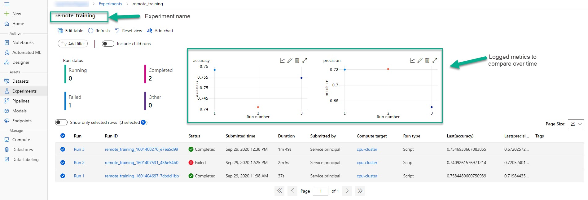
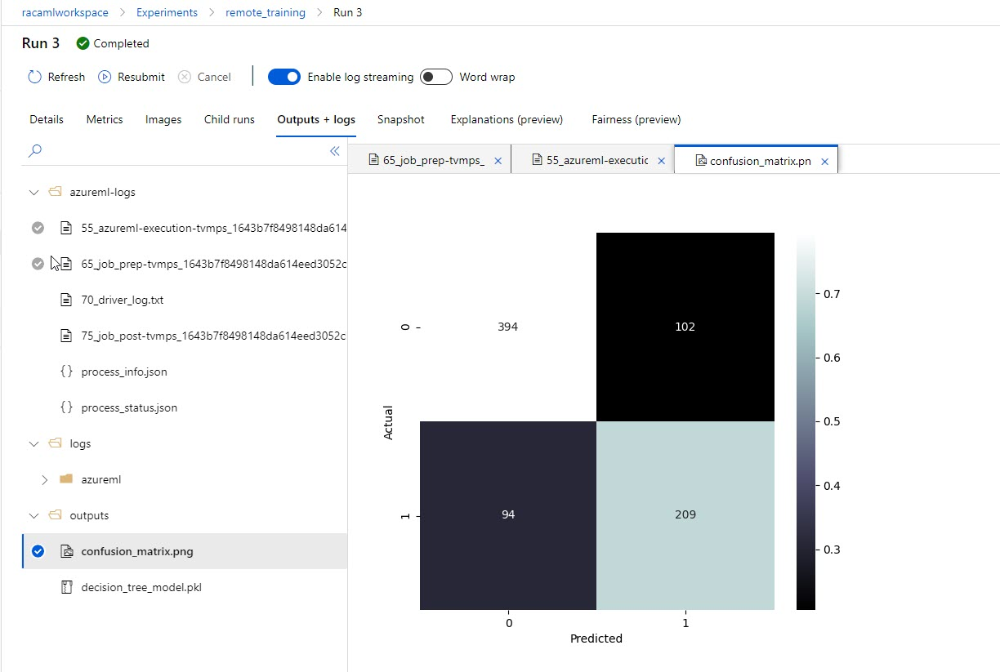

# Train Model 

In this section of the demo we will train a machine learning model on a remote compute target. The setup of the experiment will be a training script and an orchestration script which allows developers to easily change training targets and parameterize training as needed since the experiment run submission is done outside the training script. 

Please note that I did attempt to train the model locally as well but ran into a lot of difficulties. I found that when you would like to train a model locally that it is easiest to not use an orchestration script and to simply start the experiment run from within the training script. 


### Training Script

To train the model on a remote compute target we will first need to create a [training script](../src/train.py). 
```python
import pandas as pd
import numpy as np
from sklearn.tree import DecisionTreeClassifier 
from sklearn.metrics import accuracy_score, precision_score, confusion_matrix
from sklearn.model_selection import train_test_split
import matplotlib.pyplot as plt
import common as common
import pickle
from azureml.core import Run, Model

# NOTE: this allows us to do logging within our training script but still orchestrate it from another file. 
run = Run.get_context()

# load data and keep the transformations minimal
df = pd.read_csv("https://web.stanford.edu/class/archive/cs/cs109/cs109.1166/stuff/titanic.csv")
df = pd.get_dummies(df,prefix=['Pclass'], columns = ['Pclass'])
df = pd.get_dummies(df,prefix=['Sex'], columns = ['Sex'])
df = df.dropna()
df.head()

# identify a handful of training columns
label = 'Survived'
training_cols = ['Pclass_1', 'Pclass_2', 'Pclass_3', 'Sex_male', 'Sex_female', 'Age', 'Siblings/Spouses Aboard', 'Parents/Children Aboard']

# split datasets
x_train, x_test, y_train, y_test = train_test_split(df[training_cols].values, np.array(df[label], dtype=int), test_size=0.9)

# train model
mod = DecisionTreeClassifier(max_depth=5)
mod.fit(x_train, y_train)

# make sure we can predict a value
preds = mod.predict(x_test)

cm = confusion_matrix(y_test, preds)
common.plot_confusion_matrix(cm, ['0', '1'])
plt.savefig("outputs/confusion_matrix.png")

precision = precision_score(y_test,preds)
accuracy = accuracy_score(y_test,preds)

run.log('precision', precision)
run.log('accuracy', accuracy)

with open('outputs/decision_tree_model.pkl', 'wb') as f:
    pickle.dump(mod, f)


Model.register(run.experiment.workspace, 'outputs/decision_tree_model.pkl', 'decision_tree_model', tags={'precision': precision, 'accuracy': accuracy})
```

NOTE:  
    - `Run.get_context()` gives us the ability to execute the training procedure from another script i.e. `execute_train.py`, and obtain the experiment run information so that we are still able to log and save information.  
    - `run.log` allows us to log and track various information about our experiment which gives us the ability to view metrics over time and accross parallel trainings. 
    - The `outputs` directory is automatically uploaded to our workspace when training is complete. Therefore, by saving a confusion matrix and a pickled model to the directory allows us to store the objects long term.  


### Environment File  
Once we have our training script defined, we will create our yml file that describes our anaconda environment. Save this to `.azureml/env.yml`   
```yml
name: sklearn-env
channels:
    - defaults
dependencies:
    - python=3.6.12
    - pip: 
        - azureml-sdk==1.14.0
        - pandas
        - scikit-learn
        - seaborn
```

### Orchestration Script  

Next we will **create and execute** our orchestration script.  
```python
import os
import azureml.core
from azureml.core import Workspace, Experiment, Environment, ScriptRunConfig, Run
from azureml.core.authentication import ServicePrincipalAuthentication


exp_name = 'remote_training'
workspace_name = os.environ.get('workspace_name')
subscription_id = os.environ.get('subscription_id')
resource_group = os.environ.get('resource_group')
tenant_id = os.environ.get('tenant_id')
client_id = os.environ.get('client_id')
client_secret = os.environ.get('client_secret')
print("Azure ML SDK Version: ", azureml.core.VERSION)

# connect to your aml workspace
## NOTE: you can use Workspace.create to create a workspace using Python.  
## this authentication method will require a 
auth = ServicePrincipalAuthentication(tenant_id=tenant_id, service_principal_id=client_id, service_principal_password=client_secret)
ws = Workspace.get(name=workspace_name, auth=auth, subscription_id=subscription_id, resource_group=resource_group)

exp = Experiment(ws, exp_name)

env = Environment.from_conda_specification(name='sklearn-env', file_path='.azureml/env.yml')
config = ScriptRunConfig(source_directory='src', script='train.py', compute_target='cpu-cluster', environment=env)


run = exp.submit(config)
print(run.get_portal_url())

r = Run(exp, run.id)
r.get_details()
```

NOTE:  
    - This script launches the execution of our training script. Therefore, we need to connect to the workspace, identify the experiment, set our environment configuration, and launch the experiment on our cluster.  
    - The environment file that we created is located in the `.azureml` folder which is designated as an environment folder for the azure machine learning sdk. 
    - We are authenticating using a service principal but there are other methods as well, such as an interactive login using your browser.  


### Checking out the workspace

Once your script is excuted you should be able to navigate to your Azure Machine Learning Workspace in the browser and check out the experiment dashboard. You will notice that I have executed this experiment 3 times, and one failed because I added a bug to the training script when I started registering my model.    
  


We can drill into a run and checkout some of the artifacts that we collected, which includes all the logs, child runs, and the outputs folder.  



We can also see that we have registered a model in the workspace.  


