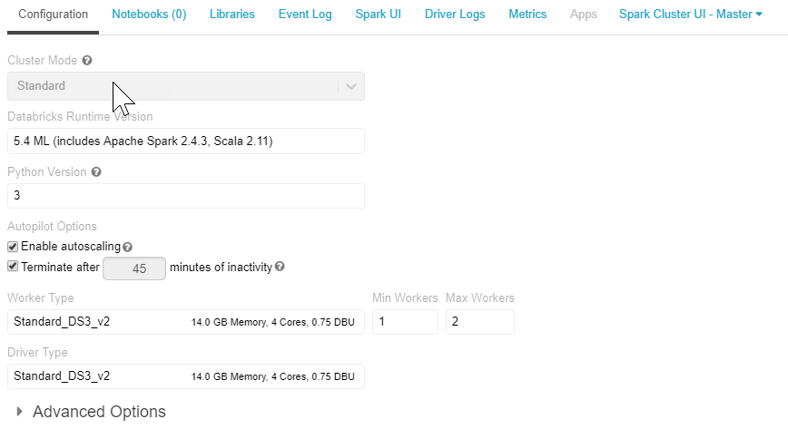

# Setting up your Azure Environment

## Configure Azure Databricks
1. Create an Azure Databricks Resource. Follow the instructions available [here](https://docs.microsoft.com/en-us/azure/azure-databricks/quickstart-create-databricks-workspace-portal).  
1. In the newly created Azure Databricks workspace. Create a databricks cluster. Please note an cluster with a max of 2 VMs using Standard_D3_v2 machines will suffice, and make sure you select Databricks Runtime Version 5.4 ML.   


1. Next we will need to install the Azure ML Python SDK. Create a [library](https://docs.databricks.com/user-guide/libraries.html#create-a-library) in Azure Databricks by importing the ```azureml-sdk[databricks]``` pypi library.  

1. We will also need to install the MLFlow library. Create a [library](https://docs.databricks.com/user-guide/libraries.html#create-a-library) in Azure Databricks by importing the `mlflow` pypi library. 

1. Lastly, install another AzureML library. Create a [library](https://docs.databricks.com/user-guide/libraries.html#create-a-library) in Azure Databricks by importing the `azureml-contrib-run` pypi library. Please note that you may need to restart you Databricks cluster. 


1. Verify that the library was installed successfully by creating a notebook called "ConfigureCluster". Then paste the following code into a cell and run it.  
    ```python
    import azureml
    from azureml.core import Workspace, Run
    import mlflow
    ```

## Create an Azure Machine Learning Workspace
An Azure Machine Learning Workspace is the building block for training, monitoring, and deploying machine learning models in Azure using the Azure Machine Learning Service. We will create a workspace using the Azure Portal following the instructions [here](https://docs.microsoft.com/en-us/azure/machine-learning/service/quickstart-get-started#create-a-workspace).  

Please make note of the following:
- Azure Subscription Id  
- Resource Group Name  
- Azure Machine Learning Workspace Name  
- Azure Machine Learning Workspace Region

When we create an Azure Machine Learning Workspace, we also get a storage account. We will want to mount the Azure Storage Account to our cluster. 

1. Create a new container `mlflow` in your Azure ML Workspace. 

1. Create a [`ConfigureCluster`](../code/00_ConfigureCluster.py) notebook.

1. To mount a storage account provide the container name, account name, and account key. Please note that I usually recommend mounting an Azure Data Lake Store to your Databricks cluster to save data and machine learning models, however, for the purpose of this walk through we will use a Blob Container. 
    ```python
    container_name = ""
    account_name = ""
    account_key = ""

    dbutils.fs.mount(
    source = "wasbs://{}@{}.blob.core.windows.net".format(container_name, account_name),
    mount_point = "/mnt/{}/{}".format(account_name, container_name),
    extra_configs = {"fs.azure.account.key."+account_name+".blob.core.windows.net": account_key})
    ```

Please make note that in our scripts we complete an interactive web login to authenticate against our Azure ML Workspace. If you wish to authenticate other ways please reference this [Notebook](https://github.com/Azure/MachineLearningNotebooks/blob/master/how-to-use-azureml/manage-azureml-service/authentication-in-azureml/authentication-in-azure-ml.ipynb) put together by Microsoft.   


