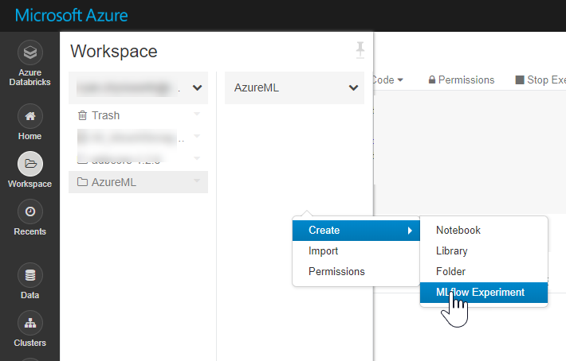

# Train a Machine Learning Model with MLFlow

MLFlow is an end-to-end data science tool allowing developers to track their experiments. MLFlow is built into Azure Databricks making the integration simple, and allows a engineers to go to a single location for development, analysis of runs, and managing workflows. 

The following portion of the demo shows users how to create a MLFlow Experiment and train a machine learning model.  

1. Create an MLFlow Experiment in your Azure Databricks Workspace, please provide the name "MLFlowExp" and an artifact location of the mount we created in the configure cluster portion of the demo `dbfs:/mnt/<storage_name>/<container_name>/MLFlowExp`. 
    

1. Once we have an experiment it is time to create our [`TrainWithMLFlow`](../code/01_TrainWithMLFlow.py) Databricks Notebook. Please note that I am creating a folder in my workspace called "AzureML_MLFlow" and I will be running my notebooks from there.  

1. Now let's import the libraries we will be using. 
    ```python
    import mlflow
    from mlflow.tracking import MlflowClient
    from pyspark.ml.regression import LinearRegression
    from pyspark.ml.evaluation import RegressionEvaluator
    from pyspark.ml import Pipeline
    import datetime as dt
    from pyspark.ml.feature import OneHotEncoder, VectorAssembler
    ```

1. By default our experiments are created in our user directory in our Databricks workspaces. In order to programmatically get our experiment we should can run the following scala code, which allows us to pull the MLFlow experiment by filtering.  
    ```scala
    %scala
    val tags = com.databricks.logging.AttributionContext.current.tags
    val username = tags.getOrElse(com.databricks.logging.BaseTagDefinitions.TAG_USER, java.util.UUID.randomUUID.toString.replace("-", ""))
    spark.conf.set("com.databricks.demo.username", username)
    ```

1. Create our MLFlow Client. 
    ```python
    client = MlflowClient() # client
    exps = client.list_experiments() # get all experiments
    exps # take note of the Experiment name.
    ```

1. Now we will filter to the experiment that we want and extract some of the variables we are interested in using while training. Please make note that "AzureML_MLFlow" in the path is due to the folder I save my notebooks in.    
    ```python
    exp = [s for s in exps if "/Users/{}/AzureML_MLFlow/MLFlowExp".format(spark.conf.get("com.databricks.demo.username")) in s.name][0] # get only the exp we want
    exp_id = exp.experiment_id # save exp id to variable
    artifact_location = exp.artifact_location # artifact location for storing
    run = client.create_run(exp_id) # create the run
    run_id = run.info.run_id # get the run id
    ```

1. Start our experiment. 
    ```python
    # start and mlflow run
    mlflow.start_run(run_id)
    ```

1. Next we will train and test our model. This includes logging metrics and saving our model and test results.  
    ```python
    try: 
    df = (spark
            .read
            .format("csv")
            .option("inferSchema", "True")
            .option("header", "True")
            .load("/databricks-datasets/bikeSharing/data-001/day.csv")
        )
    # split data
    train_df, test_df = df.randomSplit([0.7, 0.3])

    # One Hot Encoding
    mnth_encoder = OneHotEncoder(inputCol="mnth", outputCol="encoded_mnth")
    weekday_encoder = OneHotEncoder(inputCol="weekday", outputCol="encoded_weekday")

    # set the training variables we want to use
    train_cols = ['encoded_mnth', 'encoded_weekday', 'temp', 'hum']

    # convert cols to a single features col
    assembler = VectorAssembler(inputCols=train_cols, outputCol="features")

    # Set linear regression model
    lr = LinearRegression(featuresCol="features", labelCol="cnt")

    # Create pipeline
    pipeline = Pipeline(stages=[
        mnth_encoder,
        weekday_encoder,
        assembler,
        lr
    ])

    # fit pipeline
    lrPipelineModel = pipeline.fit(train_df)

    # write model to datetime folder and latest folder
    lrPipelineModel.write().overwrite().save("{}/latest/bike_sharing_model.model".format(artifact_location))
    lrPipelineModel.write().overwrite().save("{}/year={}/month={}/day={}/bike_sharing_model.model".format(artifact_location, dt.datetime.utcnow().year, dt.datetime.utcnow().month, dt.datetime.utcnow().day))

    # write test predictions to datetime and lastest folder
    predictions = lrPipelineModel.transform(test_df)
    predictions.write.format("parquet").mode("overwrite").save("{}/latest/test_predictions.parquet".format(artifact_location))
    predictions.write.format("parquet").mode("overwrite").save("{}/year={}/month={}/day={}/test_predictions.parquet".format(artifact_location, dt.datetime.utcnow().year, dt.datetime.utcnow().month, dt.datetime.utcnow().day))

    # mlflow log evaluations
    evaluator = RegressionEvaluator(labelCol = "cnt", predictionCol = "prediction")

    mlflow.log_metric("mae", evaluator.evaluate(predictions, {evaluator.metricName: "mae"}))
    mlflow.log_metric("rmse", evaluator.evaluate(predictions, {evaluator.metricName: "rmse"}))
    mlflow.log_metric("r2", evaluator.evaluate(predictions, {evaluator.metricName: "r2"}))
    mlflow.set_tag("Model Path", "{}/year={}/month={}/day={}".format(artifact_location, dt.datetime.utcnow().year, dt.datetime.utcnow().month, dt.datetime.utcnow().day))

    mlflow.end_run(status="FINISHED")
    print("Model training finished successfully")
    except Exception as e:
    mlflow.log_param("Error", str(e))
    mlflow.end_run(status="FAILED")
    print("Model training failed: {}".format(str(e)))
    ```

1. After the run completes you can navigate to the MLFlow Experiment to see the run!  
    

