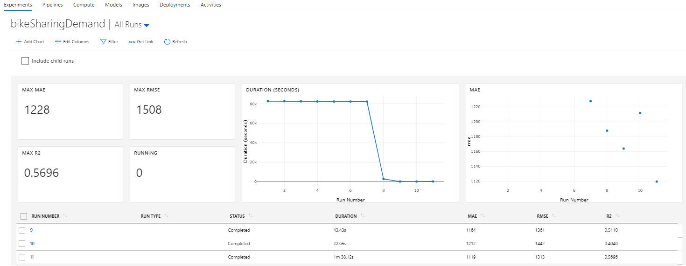

# Train a Model with Azure ML on Azure Databricks

This portion of the demo is very similar to the demo previously provided in my Azure Machine Learning with Azure Databricks demo, however, for the sake this demo I provide the example here as well. Azure Machine Learning is very similar to MLFlow by allowing engineers to track and log experiments over time. However, Azure ML extends past where MLFlow ends by giving users the ability to manage models, deployments, and data pipelines. For more information on deploying with Azure ML please check out my blog mentioned previously.  

1. Let's create a new Python Notebook called [`TrainWithAzureML`](../Code/02_TrainWithAzureML.py). 

1. Next we will import our libraries. 
    ```python
    import azureml
    from azureml.core import Workspace, Run, Experiment
    from azureml.train.estimator import Estimator

    import os, shutil
    from pyspark.ml.regression import LinearRegression
    from pyspark.ml.evaluation import RegressionEvaluator
    from pyspark.ml import Pipeline
    import datetime as dt
    from pyspark.ml.feature import OneHotEncoder, VectorAssembler
    ```

1. Connect to our workspace with an interactive login. For other login options check out this notebook put together by Microsoft. I would recommend using the Service Principal Authentication method for all your notebooks.  
    ```python
    # set aml workspace parameters here. 
    subscription_id = ""
    resource_group = ""
    workspace_name = ""
    workspace_region = ""

    ws = Workspace(subscription_id = subscription_id, resource_group = resource_group, workspace_name = workspace_name)
    ```

1. Create a new Azure ML Experiment.  
    ```python
    # create experiment
    experiment_name = 'bikeSharingDemand'
    exp = Experiment(workspace=ws, name=experiment_name)
    ```

1. Start our Run. 
    ```python
    run = exp.start_logging(snapshot_directory=None)
    ```

1. Next we will train a simple linear regression problem using Databricks' Pipeline capabilities. 
    ```python
    df = (spark
            .read
            .format("csv")
            .option("inferSchema", "True")
            .option("header", "True")
            .load("/databricks-datasets/bikeSharing/data-001/day.csv")
        )

    # split data
    train_df, test_df = df.randomSplit([0.7, 0.3])

    # One Hot Encoding
    mnth_encoder = OneHotEncoder(inputCol="mnth", outputCol="encoded_mnth")
    weekday_encoder = OneHotEncoder(inputCol="weekday", outputCol="encoded_weekday")

    # set the training variables we want to use
    train_cols = ['encoded_mnth', 'encoded_weekday', 'temp', 'hum']

    # convert cols to a single features col
    assembler = VectorAssembler(inputCols=train_cols, outputCol="features")

    # Set linear regression model
    lr = LinearRegression(featuresCol="features", labelCol="cnt")

    # Create pipeline
    pipeline = Pipeline(stages=[
        mnth_encoder,
        weekday_encoder,
        assembler,
        lr
    ])

    # fit pipeline
    lrPipelineModel = pipeline.fit(train_df)

    # write test predictions to datetime and lastest folder
    predictions = lrPipelineModel.transform(test_df)

    # mlflow log evaluations
    evaluator = RegressionEvaluator(labelCol = "cnt", predictionCol = "prediction")

    run.log("mae", evaluator.evaluate(predictions, {evaluator.metricName: "mae"}))
    run.log("rmse", evaluator.evaluate(predictions, {evaluator.metricName: "rmse"}))
    run.log("r2", evaluator.evaluate(predictions, {evaluator.metricName: "r2"}))
    ```

1. Now that we have trained a model, tested our model, and logged the metrics, we will want to upload our model so that we can associate our Azure ML Run with this model. Additionally, we will want to register the model. Registering a model makes it available to deploy as a web service while uploading the model just stores it for later use and traceability.  

    For now we will need to save our model to a temporary location on our Databricks FileSystem so that we can upload it using the AzureML SDK.     

    ```python
    model_nm = "bikeshare.mml"
    model_output = '/mnt/azml/outputs/'+model_nm
    model_dbfs = "/dbfs"+model_output
    lrPipelineModel.write().overwrite().save(model_output)
    ```

1. Now upload and register our model. 
    ```python
    model_name, model_ext = model_dbfs.split(".")
    model_zip = model_name + ".zip"
    shutil.make_archive(model_name, 'zip', model_dbfs)
    run.upload_file("outputs/" + model_nm, model_zip)
    # looks to register the model we published to the output folder of our workspace
    # the register_model function does not look for a model locally but the model in the cloud
    run.register_model(model_name = 'model_nm', model_path = "outputs/" + model_nm)
    ```

1. Now clean up our temporary local files and finish the run. 
    ```python
    # now delete the serialized model from local folder since it is already uploaded to run history 
    shutil.rmtree(model_dbfs)
    os.remove(model_zip)

    run.complete()
    ```

1. If you navigate to your Azure ML Workspace you can select our experiment and view the run(s).   
    